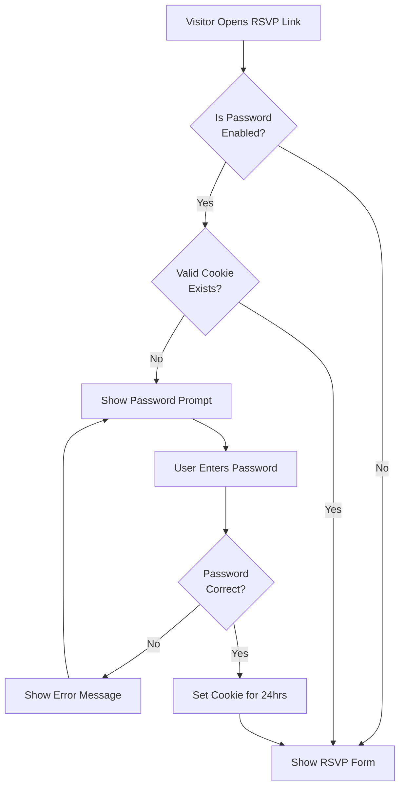

# Mobile & RSVP Improvements Plan

## Overview

This plan addresses three distinct UI/UX issues: iOS-specific dropdown styling problems, RSVP page security, and mobile performance optimization for the spotlight tour feature.

---

## Issue 1: Password Protection for RSVP Page

### Problem

The RSVP page is publicly accessible via the custom slug URL, allowing anyone with the link to access it. Users need the ability to add an optional password layer to prevent unauthorized access.

### Solution Architecture



### Implementation Steps

#### 1. Database Schema Updates

**File:** [`instant.schema.ts`](instant.schema.ts)

Add new fields to the `rsvpSettings` entity:

- `password_protected`: boolean (optional, default false)
- `rsvp_password`: string (optional, stores the plain password - for simplicity, or use hashed if preferred)

#### 2. RSVP Manager UI Updates

**File:** [`app/(main)/rsvp-manager/page.tsx`](app/\\\\\(main)/rsvp-manager/page.tsx)

Add a new section in the RSVP Form Settings card (at the top of form fields):

- Add `data-tour="password-protection"` attribute to the container div
- Toggle for "Password Protection"
- Password input field (only shown when toggle is enabled)
- Info text explaining that guests will need this password to access the RSVP form
- Include in the save settings function

#### 2b. Add Spotlight Tour Step

**File:** [`lib/tourSteps.ts`](lib/tourSteps.ts)

Add a new tour step in the `rsvp-manager` array (after the rsvp-link-section step, before rsvp-settings step):

```typescript
{
  target: '[data-tour="password-protection"]',
  title: 'Password Protection (Optional)',
  description: 'Add an extra layer of security to your RSVP page. When enabled, guests will need to enter a password before they can access your RSVP form',
  position: 'bottom'
}
```

Update the existing "Customize Your Form" step description to remove redundancy since password protection will now have its own step.

#### 3. RSVP Page Password Gate

**File:** [`app/rsvp/[slug]/page.tsx`](app/rsvp/[slug]/page.tsx)

Add password verification logic:

- Create a new state for password authentication status
- Check if `rsvpSettings.password_protected` is true
- If protected and not authenticated, show password prompt modal
- Use `localStorage` to remember authentication (24-hour expiry)
- On correct password, store authentication token in localStorage
- Show error message for incorrect passwords

**New Component:** Create `components/rsvp/PasswordPrompt.tsx`

- Modal with password input
- Submit button
- Error state display
- Styled consistently with the RSVP page design

#### 4. Security Considerations

- Use `localStorage` with timestamp to remember authentication for 24 hours
- Key format: `rsvp_auth_${wedding.id}`
- Value format: JSON with timestamp and verification token
- Clear old/expired tokens on page load

---

## Issue 2: iOS Mobile Dropdown Height Issue

### Problem

On actual iOS devices (iPhone Safari), `<select>` dropdown elements appear with narrow heights due to iOS Safari's default form control styling. This doesn't occur in desktop browser inspection mode, only on real iOS devices.

### Root Cause

iOS Safari applies `-webkit-appearance: menulist` by default, which uses native iOS styling that ignores custom padding/height values.

### Solution

#### 1. Update Select Component Styles

**File:** [`components/ui/Select.tsx`](components/ui/Select.tsx)

Add iOS-specific fixes to the select element:

```css
-webkit-appearance: none;
appearance: none;
min-height: 48px; /* Ensures minimum touch-friendly height */
font-size: 16px; /* Prevents iOS zoom on focus */
```

Update the className to include:

- Explicit `min-h-[48px]` for better iOS rendering
- Add `text-base` (16px) to prevent auto-zoom on focus
- Add `touch-manipulation` for better touch response

#### 2. Add Global iOS Select Fixes

**File:** [`app/globals.css`](app/globals.css)

Add iOS-specific overrides in a new section:

```css
/* iOS Safari form element fixes */
@supports (-webkit-touch-callout: none) {
  select {
    -webkit-appearance: none;
    appearance: none;
    min-height: 48px;
    font-size: 16px;
    padding: 12px 16px;
  }
  
  input, textarea {
    font-size: 16px; /* Prevent zoom on focus */
  }
}
```

#### 3. Test Affected Pages

Verify the fix on these pages (all contain Select components):

- [`app/(main)/guests/page.tsx`](app/\\\\\(main)/guests/page.tsx) - RSVP Status filter, Sort By filter
- [`components/guests/GuestFormModal.tsx`](components/guests/GuestFormModal.tsx) - Side, RSVP Details, Household ID
- [`app/(main)/budget/page.tsx`](app/\\\\\(main)/budget/page.tsx) - Category dropdown
- [`components/budget/BudgetFormModal.tsx`](components/budget/BudgetFormModal.tsx) - Category dropdown
- [`app/rsvp/[slug]/page.tsx`](app/rsvp/[slug]/page.tsx) - Meal preference dropdown

---

## Issue 3: Laggy Spotlight Autoscroll on Mobile

### Problem

The spotlight tour's smooth scrolling (`scrollIntoView` with `behavior: 'smooth'`) is laggy on actual mobile devices, though it works fine on desktop and desktop mobile inspection mode. This is due to mobile browser performance limitations with smooth scroll animations.

### Solution: Progressive Enhancement with Device Detection

#### 1. Update SpotlightTour Component

**File:** [`components/tour/SpotlightTour.tsx`](components/tour/SpotlightTour.tsx)

Modify the `updateTargetRect` function around line 36-48:

**Changes:**

- Add device performance detection using `navigator.hardwareConcurrency` or user agent
- Implement adaptive scroll behavior:
  - Desktop: Use `'smooth'` behavior
  - High-end mobile: Use `'smooth'` with reduced complexity
  - Low-end mobile: Use `'auto'` (instant scroll)
- Reduce animation duration for mobile devices
- Use `requestAnimationFrame` for smoother updates

**Implementation approach:**

```typescript
// Add at component level
const isMobile = /iPhone|iPad|iPod|Android/i.test(navigator.userAgent)
const scrollBehavior = isMobile ? 'auto' : 'smooth'

// Update scrollIntoView call
element.scrollIntoView({
  behavior: scrollBehavior,
  block: scrollBlock,
  inline: 'center',
})
```

#### 2. Optimize Animation Transitions

**File:** [`components/tour/SpotlightTour.tsx`](components/tour/SpotlightTour.tsx)

Around lines 122-125, modify the motion transition:

- Reduce duration from 0.3s to 0.2s on mobile
- Use `will-change: transform, opacity` hint for GPU acceleration
- Simplify easing function on mobile devices

#### 3. Add Debouncing for Scroll/Resize Updates

**File:** [`components/tour/SpotlightTour.tsx`](components/tour/SpotlightTour.tsx)

Around lines 60-68, optimize event listeners:

- Add debounce utility (100ms) for scroll/resize handlers
- Use `passive: true` flag for scroll listeners on mobile
- Reduce update frequency on mobile devices

#### 4. Optional: Disable Animations on Low-End Devices

Add a performance check:

```typescript
const prefersReducedMotion = window.matchMedia('(prefers-reduced-motion: reduce)').matches
const isLowEndDevice = navigator.hardwareConcurrency <= 4
const shouldReduceMotion = prefersReducedMotion || (isMobile && isLowEndDevice)
```

Use this flag to skip transitions entirely if device is struggling.

---

## Testing Checklist

### Password Protection

- [ ] Enable password protection in RSVP Manager
- [ ] Set a custom password
- [ ] Open RSVP link in incognito - should show password prompt
- [ ] Enter wrong password - should show error
- [ ] Enter correct password - should access form
- [ ] Verify authentication persists on page refresh
- [ ] Test in read-only mode (Etsy trial users)

### Mobile Dropdowns (Test on actual iPhone)

- [ ] Guest list page - RSVP Status filter appears with proper height
- [ ] Guest list page - Sort By filter appears with proper height
- [ ] Add guest modal - Side dropdown has proper height
- [ ] Add guest modal - RSVP Details dropdown has proper height
- [ ] Add guest modal - Household ID dropdown has proper height
- [ ] Budget page - Category dropdown has proper height
- [ ] RSVP page - Meal preference dropdown has proper height
- [ ] Verify no zoom on focus for any input/select element

### Spotlight Tour on Mobile (Test on actual iPhone)

- [ ] Dashboard tour - scrolling is smooth or instant (not laggy)
- [ ] Guests page tour - no lag when moving between steps
- [ ] Budget page tour - autoscroll works without jank
- [ ] RSVP Manager tour - tooltip positioning is correct
- [ ] RSVP Manager tour - new password protection step appears and highlights correctly
- [ ] Verify performance on older iPhone models (iPhone X or earlier)

---

## Files to Modify

### New Files

1. `components/rsvp/PasswordPrompt.tsx` - Password entry modal component

### Modified Files

1. `instant.schema.ts` - Add password fields to rsvpSettings
2. `app/(main)/rsvp-manager/page.tsx` - Add password settings UI with tour attribute
3. `app/rsvp/[slug]/page.tsx` - Add password gate logic
4. `lib/tourSteps.ts` - Add password protection tour step
5. `components/ui/Select.tsx` - Add iOS-specific styling fixes
6. `app/globals.css` - Add global iOS form element overrides
7. `components/tour/SpotlightTour.tsx` - Optimize scroll behavior for mobile
8. `components/tour/TourStep.tsx` - Optimize animation transitions (optional)

---

## Estimated Complexity

- **Issue 1 (Password Protection):** Medium - Requires DB schema update, UI changes, and localStorage logic
- **Issue 2 (iOS Dropdowns):** Low - CSS-only fix with testing
- **Issue 3 (Spotlight Performance):** Medium - Requires performance detection and conditional behavior

---

## Notes

- Password protection uses simple plain-text storage for ease of use (suitable for this use case)
- iOS dropdown fix uses `@supports` query to target only iOS Safari
- Spotlight optimization uses progressive enhancement - works everywhere, optimizes for mobile
- All changes maintain backwards compatibility with existing data